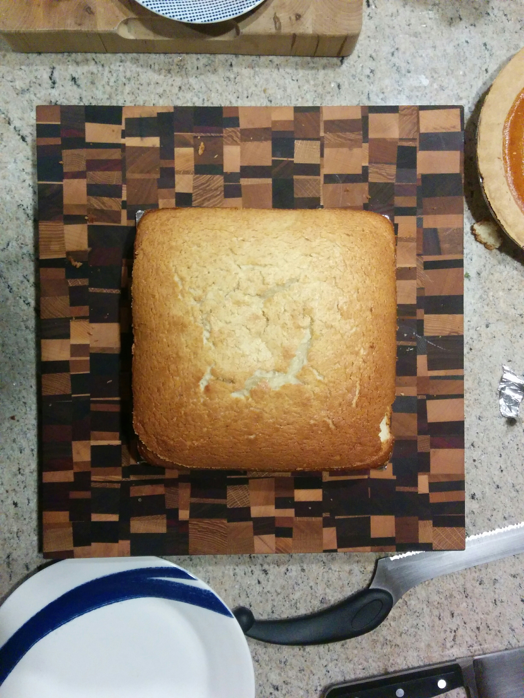
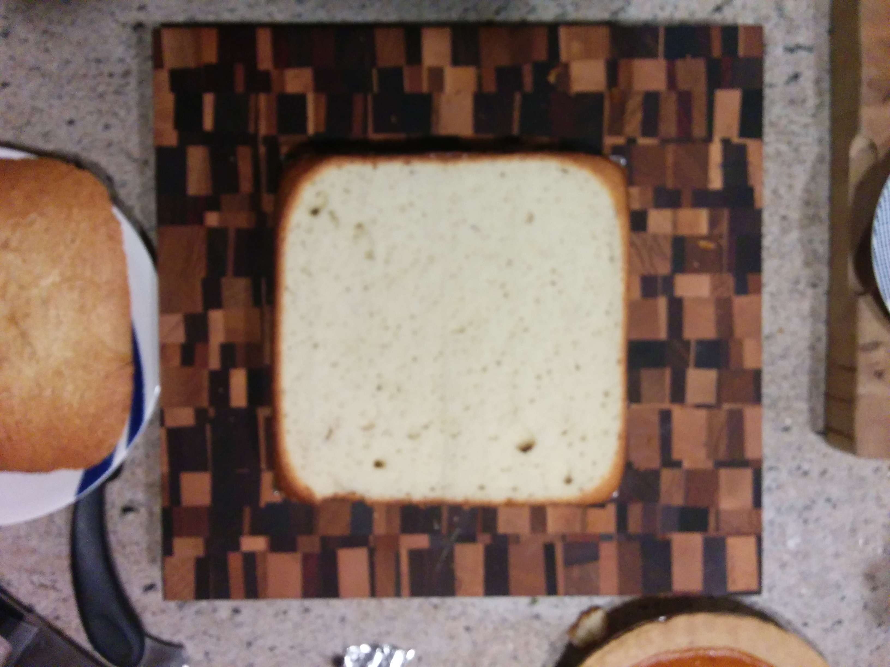
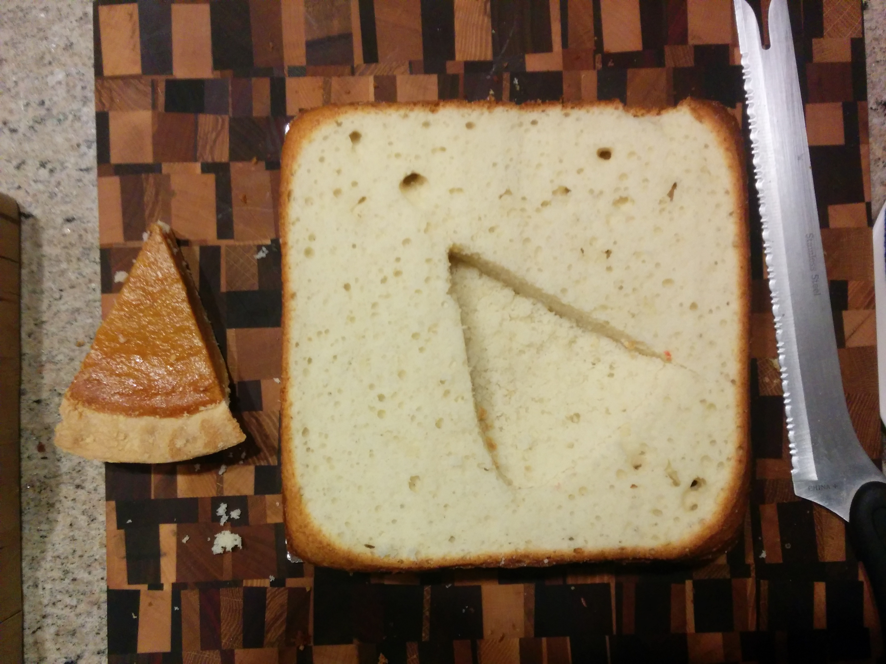
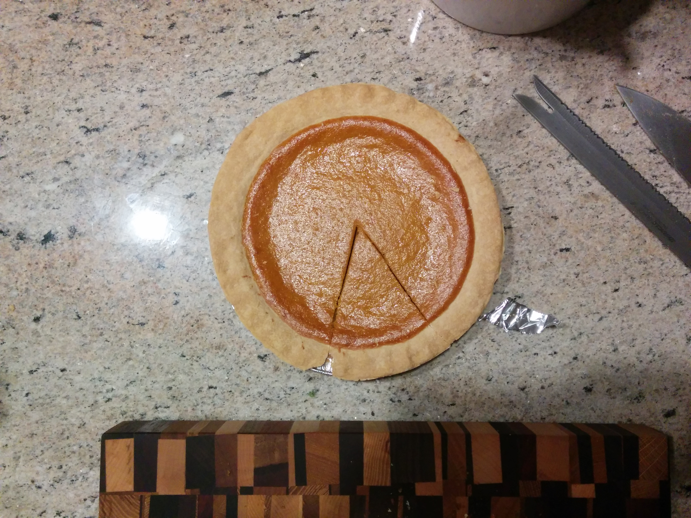
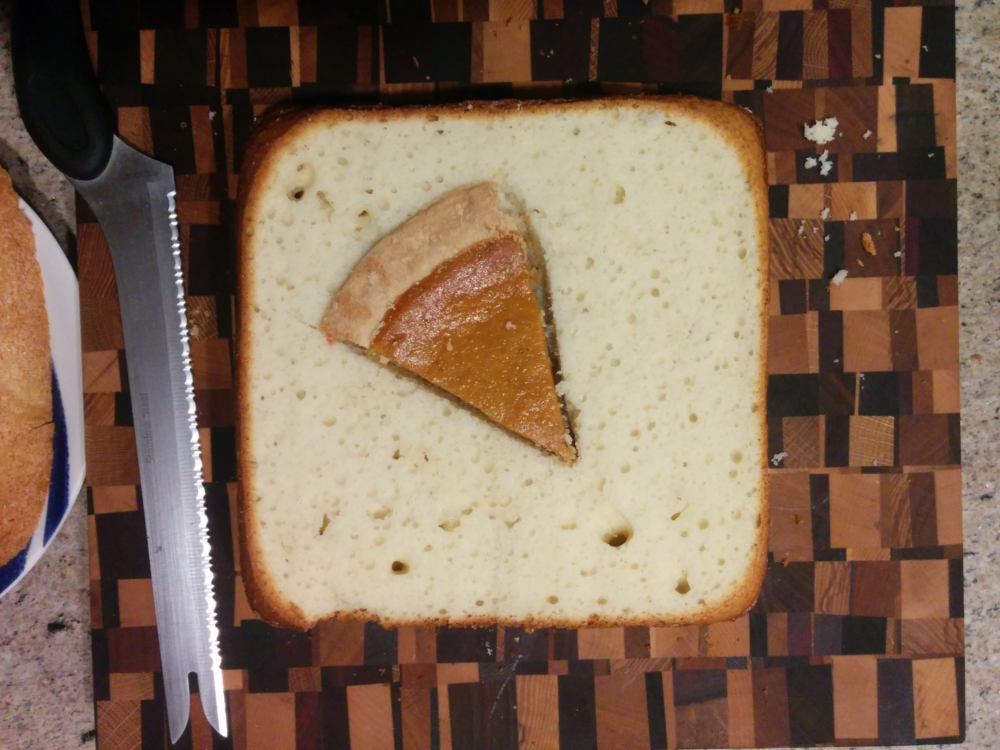
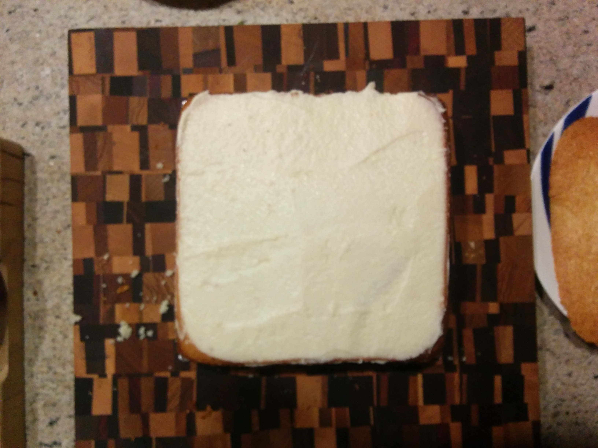
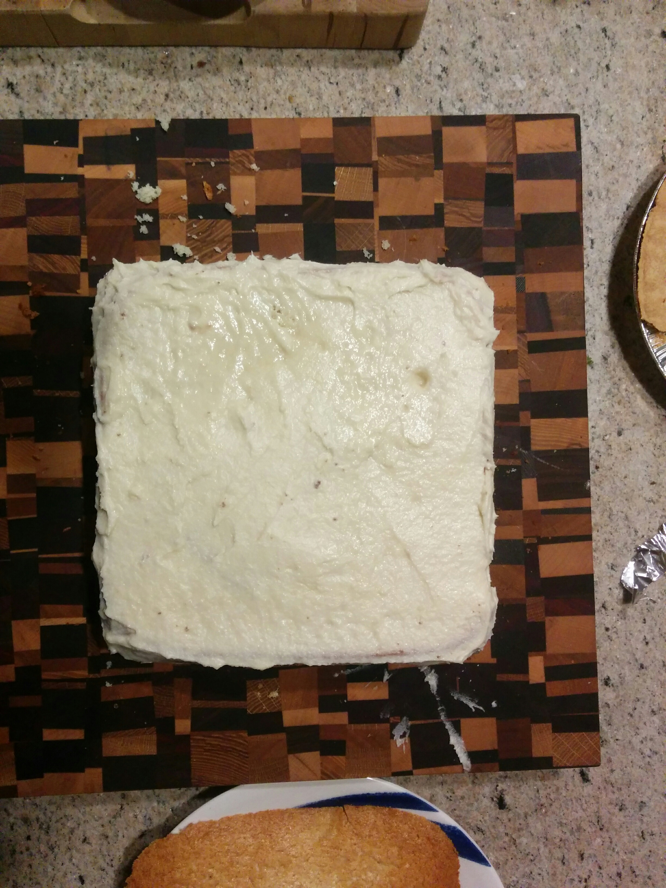
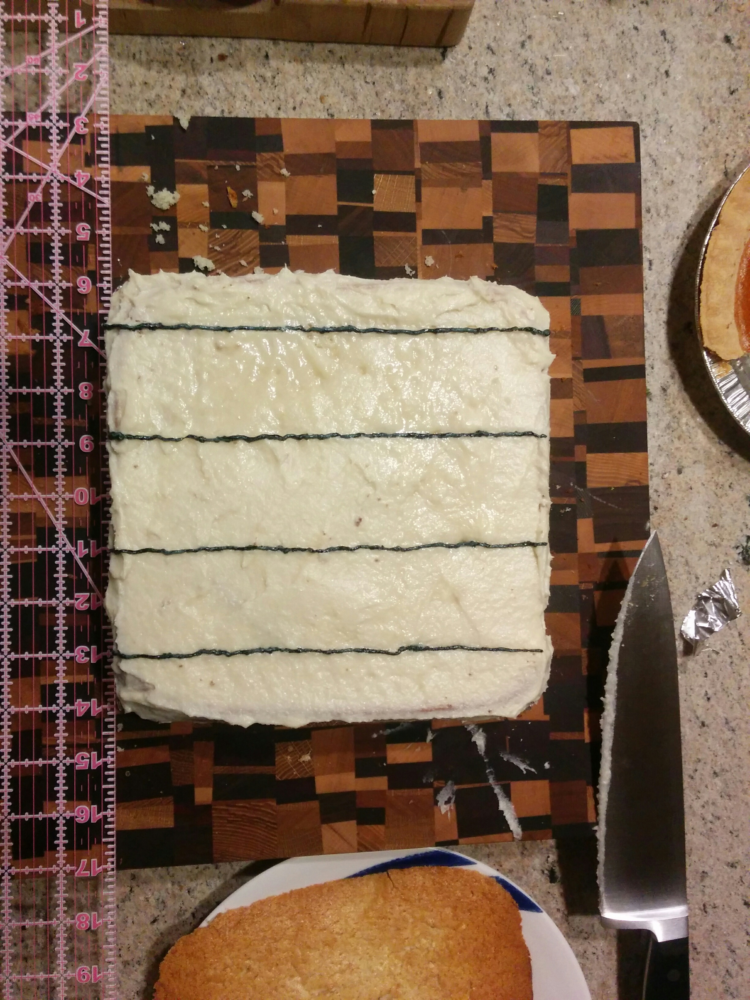
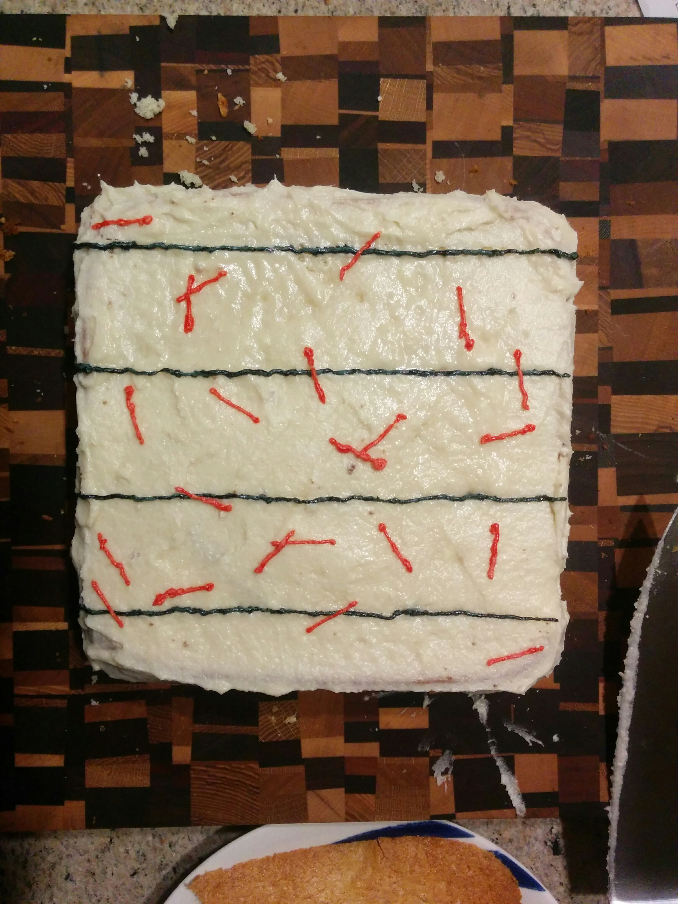

It's that magical time of year again. The smell is in the air! 

Pi day is here again. 

This Pi Day season, I found myself thinking more deeply about the true meaning of Pi Day. Beyond all the commercialization of Pies and the battle over Tau. Because Pi day is so much more than just circles and Pecan Pies, and sometimes it surprises you! That's why this year's theme and bad-pun-of-the year is: 

Surpies Pi[e]s

Pi can show up where you least expect it. Just ask Georges-Louis Leclerc, Comte de Buffon. He started off asking a simple question: If I drop a needle on a floor with parallel cracks on it, what are the chances that part of the needle lands on a crack? The answer? [2L/(πD)](https://en.wikipedia.org/wiki/Buffon%27s_needle). L is the length of the needle. D is the distance between cracks. So thanks to Pi this means that with 22 needles, 7 would be expected to cross with D=2 and L=1. Great! This means we can fit Pi into a square! And given that we are having a suprise Pi, we might as well put in a surprise pie while we're at it, just for good measure.

Presenting: Surpies Pi[e]s

