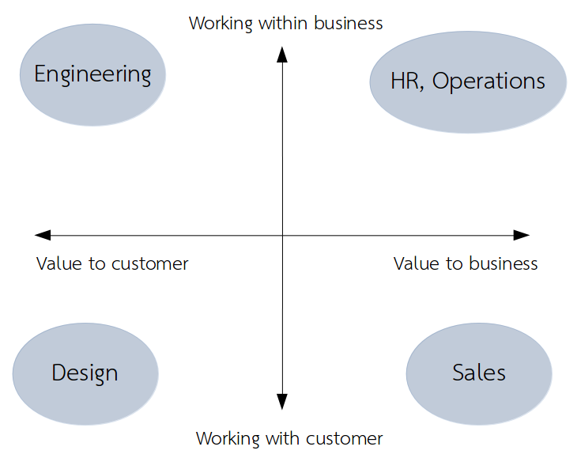

I came up with the following diagram when trying to explain part of the product development process to someone a few weeks ago:

The key idea is that a business needs to focus on value being created for:

- The customers
- The business

This will require spending time working with:

- Others in the business
- The customer

Breaking things up like this gives a pretty clear deliniation of the goals of different departments. Obviously the particular roles here vary by organization and team, but you should be able to have a pretty good feel for where each role might fit on the chart.

- Engineering has to build what the customer wants, spending a lot of their time working in the lab. The better they do their job, more value goes to the customer.
- Designers have to find out what to build, spending a lot of their time with the users/customers. The better they do their job, the more value goes to the customer.
- Sales has to bring value to the business by working with customers in an attempt to actually get money for the business.
- HR/Operations has to work within a business keeping development costs under control.

A successful product business needs a healthy balance of each quadrant. If any is neglected, or acquires too much organizational power over their own mandates, the business will not sustain itself for the long term.

Another thought that I had after having visualized things in this way was on the role of Product Manager. In my experience so far, no product company goes without a position called "product manager", but no 2 companies have the same idea about about what the "product manager" responsibilities should be. I believe that this can be explained in part by where I see product manager sitting on this diagram: right in the middle. Why do we need someone in the middle at all? Well, pragmatically speaking, it helps to have people with a big picture view to try and balance everything. In fact there is often so much work in the middle here that many organizations create multiple roles in this space to try and break it up, but the underlying requirements are the same: make sure no quadrant gets left behind.

Last thought: I wonder how well you could find someone's preferred working environment or department based on personal preferences in each direction. How much do you enjoy making sure others get what they want? What about making sure that you get what you want? And how much do you like putting yourself out there for travel, or for meeting new people? How much do you like to problem solve and optimize? People's responses to these questions likely indicates which roles they might be more comfortable with.